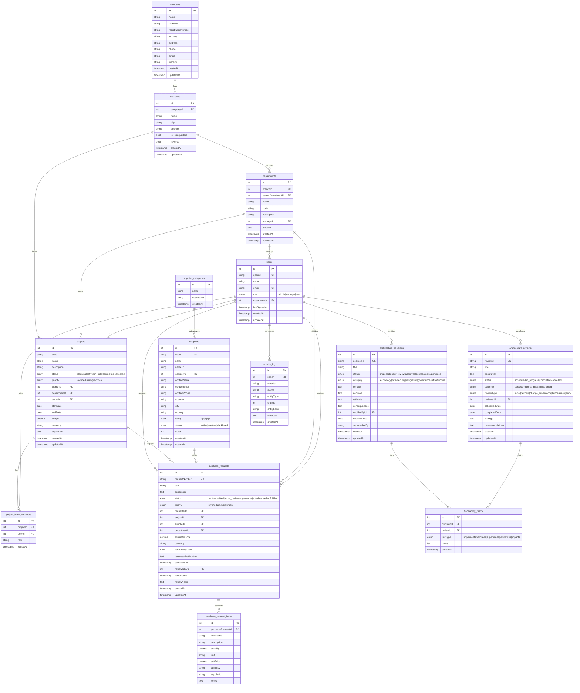

# NARQA EBOS — Database Entity Relationship Diagram

```mermaid
erDiagram
    users {
        int id PK
        string openId UK
        string name
        string email UK
        enum role "admin|manager|user"
        int departmentId FK
        timestamp lastSignedIn
        timestamp createdAt
        timestamp updatedAt
    }

    company {
        int id PK
        string name
        string nameEn
        string registrationNumber
        string industry
        string address
        string phone
        string email
        string website
        timestamp createdAt
        timestamp updatedAt
    }

    branches {
        int id PK
        int companyId FK
        string name
        string city
        string address
        bool isHeadquarters
        bool isActive
        timestamp createdAt
        timestamp updatedAt
    }

    departments {
        int id PK
        int branchId FK
        int parentDepartmentId FK
        string name
        string code
        string description
        int managerId FK
        bool isActive
        timestamp createdAt
        timestamp updatedAt
    }

    projects {
        int id PK
        string code UK
        string name
        string description
        enum status "planning|active|on_hold|completed|cancelled"
        enum priority "low|medium|high|critical"
        int branchId FK
        int departmentId FK
        int ownerId FK
        date startDate
        date endDate
        decimal budget
        string currency
        text objectives
        timestamp createdAt
        timestamp updatedAt
    }

    project_team_members {
        int id PK
        int projectId FK
        int userId FK
        string role
        timestamp joinedAt
    }

    supplier_categories {
        int id PK
        string name
        string description
        timestamp createdAt
    }

    suppliers {
        int id PK
        string code UK
        string name
        string nameEn
        int categoryId FK
        string contactName
        string contactEmail
        string contactPhone
        string address
        string city
        string country
        enum rating "1|2|3|4|5"
        enum status "active|inactive|blacklisted"
        text notes
        timestamp createdAt
        timestamp updatedAt
    }

    purchase_requests {
        int id PK
        string requestNumber UK
        string title
        text description
        enum status "draft|submitted|under_review|approved|rejected|cancelled|fulfilled"
        enum priority "low|medium|high|urgent"
        int requesterId FK
        int projectId FK
        int supplierId FK
        int departmentId FK
        decimal estimatedTotal
        string currency
        date requiredByDate
        text businessJustification
        timestamp submittedAt
        int reviewedById FK
        timestamp reviewedAt
        text reviewNotes
        timestamp createdAt
        timestamp updatedAt
    }

    purchase_request_items {
        int id PK
        int purchaseRequestId FK
        string itemName
        string description
        decimal quantity
        string unit
        decimal unitPrice
        string currency
        string supplierId
        text notes
    }

    architecture_reviews {
        int id PK
        string reviewId UK
        string title
        text description
        enum status "scheduled|in_progress|completed|cancelled"
        enum outcome "pass|conditional_pass|fail|deferred"
        enum reviewType "initial|periodic|change_driven|compliance|emergency"
        int reviewerId FK
        date scheduledDate
        date completedDate
        text findings
        text recommendations
        timestamp createdAt
        timestamp updatedAt
    }

    architecture_decisions {
        int id PK
        string decisionId UK
        string title
        enum status "proposed|under_review|approved|deprecated|superseded"
        enum category "technology|data|security|integration|governance|infrastructure"
        text context
        text decision
        text rationale
        text consequences
        int decidedById FK
        date decisionDate
        string supersededBy
        timestamp createdAt
        timestamp updatedAt
    }

    traceability_matrix {
        int id PK
        int decisionId FK
        int reviewId FK
        enum linkType "implements|validates|supersedes|references|impacts"
        text notes
        timestamp createdAt
    }

    activity_log {
        int id PK
        int userId FK
        string module
        string action
        string entityType
        int entityId
        string entityLabel
        json metadata
        timestamp createdAt
    }

    company ||--o{ branches : "has"
    branches ||--o{ departments : "contains"
    branches ||--o{ projects : "hosts"
    departments ||--o{ projects : "owns"
    departments ||--o{ users : "employs"
    users ||--o{ projects : "owns"
    projects ||--o{ project_team_members : "has"
    users ||--o{ project_team_members : "joins"
    supplier_categories ||--o{ suppliers : "categorizes"
    users ||--o{ purchase_requests : "requests"
    projects ||--o{ purchase_requests : "requires"
    suppliers ||--o{ purchase_requests : "fulfills"
    departments ||--o{ purchase_requests : "initiates"
    users ||--o{ purchase_requests : "reviews"
    purchase_requests ||--o{ purchase_request_items : "contains"
    users ||--o{ architecture_reviews : "conducts"
    users ||--o{ architecture_decisions : "decides"
    architecture_decisions ||--o{ traceability_matrix : "links"
    architecture_reviews ||--o{ traceability_matrix : "links"
    users ||--o{ activity_log : "generates"
```
